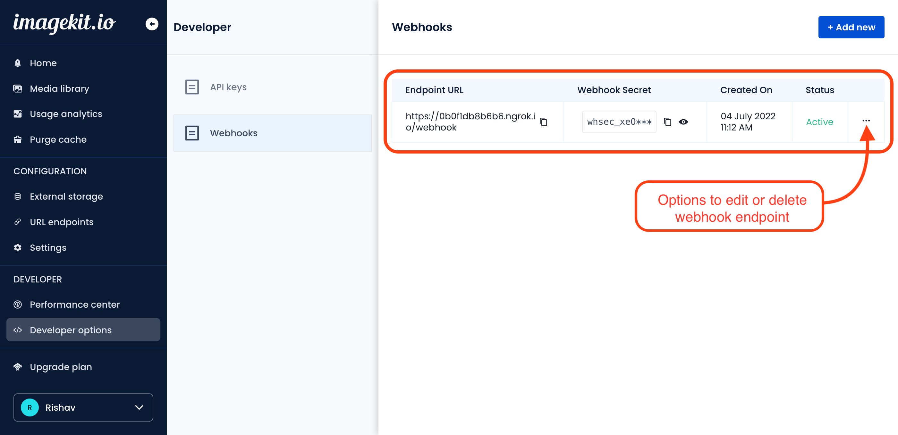

# Webhooks

Imagekit uses webhooks to notify your application when an event happens in your account. Webhooks are particularly useful for asynchronous events such as video encoding and extension processing during upload.

## Steps to receive webhooks

1. Configure the webhook in your ImageKit dashboard.
2. Create a webhook endpoint as an HTTP endpoint (URL) on your server.
3. Handle requests from ImageKit by parsing each event object and returning `2xx` response status codes.

## How to configure a Webhook?

Go to [developer options](https://imagekit.io/dashboard/developer) in ImageKit dashboard. Under Webhooks, you will see the list of webhook endpoints configured.

Click on the "Add new" button to create a new webhook endpoint.


Enter a valid HTTP(S) endpoint and click on "Create".


You should see the webhook endpoint in the list now.



To update an existing endpoint, click on `...` and change the status.


## Listen to Webhook

All webhook bodies are JSON encoded. The schema of the body may differ based on the event type, but the following fields are common.

| Field     | DataType | Description                              |
|-----------|----------|------------------------------------------|
| type      | `string` | Type of event.                           |
| id        | `string` | Unique identifier of the event.          |
| createdAt | `string` | Timestamp of the event in ISO8601 format.|
| data      | `JSON`   | Actual payload of event in JSON format.  |

### Sample code

Here is the sample code for listing to webhook by ImageKit in Node.js. Use a tool like [Ngrok](https://ngrok.com/) to make your local server accessible from outside for testing webhook implementation. 

```javascript
app.post('/webhook', express.json({type: 'application/json'}), (request, response) => {
  const event = request.body;

  // Handle the event
  switch (event.type) {
    case 'video.transformation.accepted':
      // It is triggered when a new video transformation request is accepted for processing. You can use this for debugging purposes.
      break;
    case 'video.transformation.ready':
      // It is triggered when a video encoding is finished and the transformed resource is ready to be served. You should listen to this webhook and update any flag in your database or CMS against that particular asset so your application can start showing it to users.
    case 'video.transformation.error':
      // It is triggered if an error occurs during encoding. Listen to this webhook to log the reason. You should check your origin and URL-endpoint settings if the reason is related to download failure. If the reason seems like an error on the ImageKit side, then raise a support ticket at support@imagekit.io.
      break;
    // ... handle other event types
    default:
      console.log(`Unhandled event type ${event.type}`);
  }

  // Return a response to acknowledge receipt of the event
  response.json({received: true});
});
```

## List of events

Below is the list of events for which ImageKit calls your configured webhook.

- [video.transformation.accepted](../../features/video-transformation/video-webhook-events.md#videotransformationaccepted)
- [video.transformation.ready](../../features/video-transformation/video-webhook-events.md#videotransformationready)
- [video.transformation.error](../../features/video-transformation/video-webhook-events.md#videotransformationerror)
