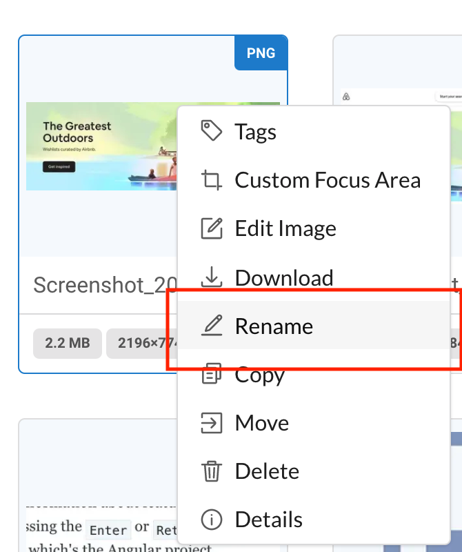

# Rename file

After you upload a file, you can rename it in the media library.

Select a file and right-click to open the options dropdown. Click on the "Rename" menu item.

It will open a modal where you can enter the new file name.

The new file name can contain:

* Alphanumeric Characters: `a-z` , `A-Z` , `0-9` \(including Unicode letters, marks, and numerals in other languages\). 
* Special Characters `.` `_` and `-`

Any other character, including space, will be replaced by an underscore character i.e. `_`.

While renaming, you can also choose to purge the CDN cache for URL with the old file name.


**Old URLs will stop working**  
When you rename a file, the URL also changes, which means the old URL will stop working. It could be cached for a while, but it will eventually stop working. 


