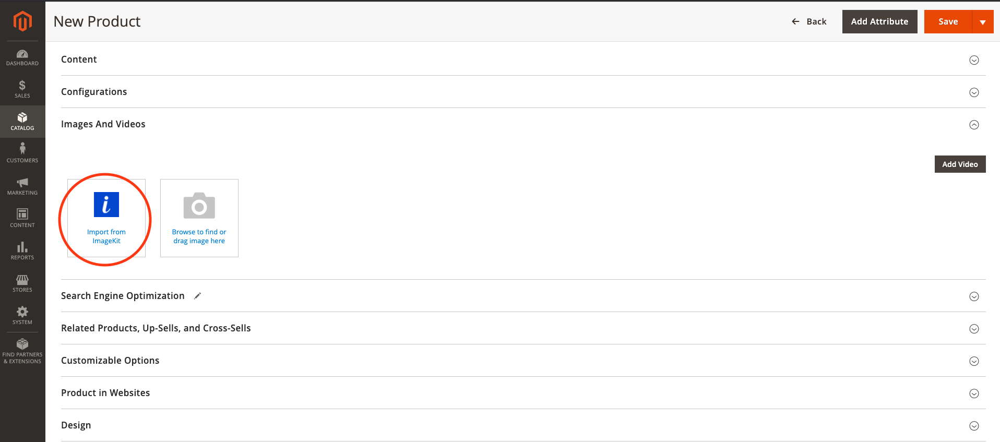
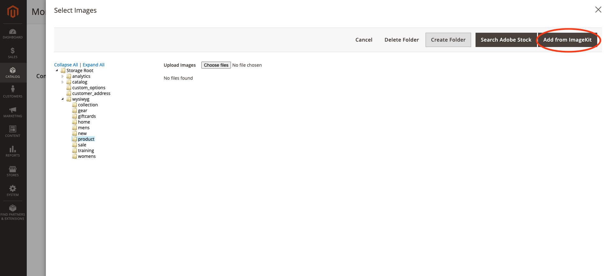

# Magento

 

Product images are the first thing shoppers want when they visit your store and a pixel-perfect first impression is crucial to driving conversions. Building your own, scalable, online store with thousands of high-quality, fast-loading, and responsive images is a breeze with ImageKit.

ImageKit provides an extension for Magento 2 that automatically updates all the image URLs in your entire store so that optimized images are fetched from ImageKit instead of your web server, ensuring better speed and search rankings. Additionally, you can dynamically create correctly-sized, responsive, and personalized product & marketing assets tailored to your campaigns and storefront - all within seconds and from a single master image. The extension also integrates ImageKit Media Library to help you leverage the complete suite of Digital Assets Management features.

## **Getting started**

Before you install the extension, make sure you have an ImageKit account. \
[Sign up](https://imagekit.io/registration/) for a free plan, starting with generous usage limits and when your requirements grow, you can easily upgrade to a plan that best fits your needs. More pricing information is available [here](https://imagekit.io/plans).

### Installing the extension

You can download and install the extension from the [Magento marketplace](https://marketplace.magento.com/imagekit-imagekit-magento.html) or install it via composer by running the following commands under your Magento 2 root dir.

```
composer require imagekit/imagekit-magento
php bin/magento maintenance:enable
php bin/magento setup:upgrade
php bin/magento setup:di:compile
php bin/magento setup:static-content:deploy
php bin/magento maintenance:disable
php bin/magento cache:flush
```

### **Configuring the extension**

Once the extension is downloaded and installed, follow these steps:

1. In the Magento Admin Panel, select Stores** **:arrow_right:** **Configuration**.**
2. On the Configuration page, open the ImageKit section in the left-hand sidebar and select Settings.
3. In the ImageKit Setup section of this page:
   1. Set your ImageKit URL endpoint (or CNAME). Copy the endpoint as found in the [ImageKit URL Endpoint Section](https://imagekit.io/dashboard#url-endpoints).
   2. Set Enable** **ImageKit to Yes.
   3. Further instructions to configure origin would be given in the ImageKit origin section
   4. Once you have configured the origin in ImageKit Dashboard, set Configuration** **Complete to Yes.
   5. Click the Save Config button at the top of the page.
4. Go to System** **:arrow_right: Cache** **Management** **and refresh your configuration and page caches. From this point onwards, if the origin is configured, any new media assets you upload will be delivered via ImageKit. 



The Configure Origin can be omitted if you only want to use assets imported from the ImageKit media library to be delivered via ImageKit. If not configured, the rest of the assets will be delivered using your Magento web server.


## **ImageKit Magento Extension features**

With ImageKit, you can add and deliver images. The ImageKit Dashboard has multiple options to change the behavior of the ImageKit extension when serving images. These are:

* **Custom domain name** - Ability to use the custom domain name to deliver media assets e.g. http://images.yourdomain.com.
* **Automatic Image Format Optimization** - Automatically deliver images converted to modern image formats based on viewing device and browser
* **Image Quality** - Adjust the quality of generated images to balance between visual quality and file size minimization
* **Image Transforms** - Leverage ImageKit Media Library to create or modify assets depending on requirements. Learn more [here](https://docs.imagekit.io/features/image-transformations).
* **ImageKit Media Library** - ImageKit Extension integrates the ImageKit Media Library right into the CMS‌

## ImageKit powered media delivery

Once the Origin is properly configured and the Configuration Complete option is set to Yes, you will find that all the images on your website would be automatically delivered through [ImageKit.io](https://imagekit.io)

.png>)

## **ImageKit Media Library integration**

[ImageKit.io](http://imagekit.io) provides highly available storage called the Media Library to all its users. It comes with a simple user interface to upload, tag, search and manage files, and folders.

‌Enjoy a fully featured ImageKit Media Library directly in Magento. Use the ImageKit Media Library UI to:‌

* Upload new images
* Search, update, rename, tag, and delete files
* Organize files in folders
* Tag files based on content
* Modify creatives with a powerful and user-friendly image editor

See the [ImageKit Media Library documentation](https://docs.imagekit.io/media-library/overview) for more information‌

Look out for the “**Add from ImageKit**” button to launch the Media Library.

You can access it in the following places:‌

* **Managing your catalog** - Add category and product images to your catalog directly from the ImageKit Media Library. 


* **Managing your site content** - Add media from ImageKit to all pages on your Magento site using the Media Library


## Using ImageKit Media Library to manage catalog images

You can import images from ImageKit Media Library directly to product pages.

### Adding product images from ImageKit Media Library

While creating a product, you will find the **Import From ImageKit** button in the **Images and Videos** section.



Use the ImageKit Media Library to find the image you wish to add and click on **Insert** on the top right corner.



You can also select multiple images of a product at once.


.png>)

On the product page, you will find that all the product images would be delivered from [ImageKit.io](http://imagekit.io) with the optimal transformations applied‌.

.png>)

### Adding Images to product description from ImageKit Media Library

You can also add images from ImageKit Media Library to the product description using the **Add from ImageKit button** in the **Select Images** modal.



## Using Magento page builder to import images

Use the Media section of the Page Builder panel, you can add images, banners, or sliders from ImageKit to any layout container on the [Page Builder stage](https://docs.magento.com/user-guide/cms/page-builder-workspace.html#stage). After adding a Media Block to the page builder stage, you’ll have the option to select the images from ImageKit.

.png>)

For instance, to add an image from ImageKit, drag and drop an image block into the page builder stage, then click **Select from Gallery**. You can open the ImageKit Media Library to manage and insert your ImageKit images by clicking **Add from ImageKit** button. 


## Using ImageKit.io to deliver non-image static assets like JS or CSS

You can also use ImageKit.io to deliver non-image type static assets like JS, CSS, or font files. Navigate to Stores :arrow_right:Configurations :arrow_right: Web:

For **Base URL for Static View Files**, set`your_imagekit_url_endpoint_with_origin_configured/static/`  or `your_imagekit_url_endpoint_with_origin_configured/pub/static/`  depending on your setup.

.png>)

