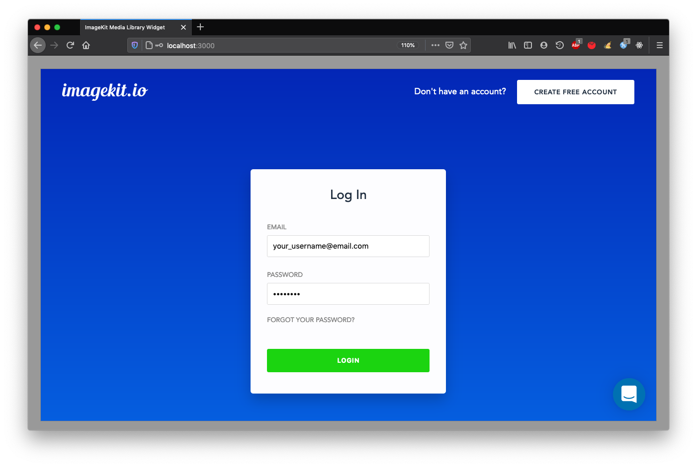
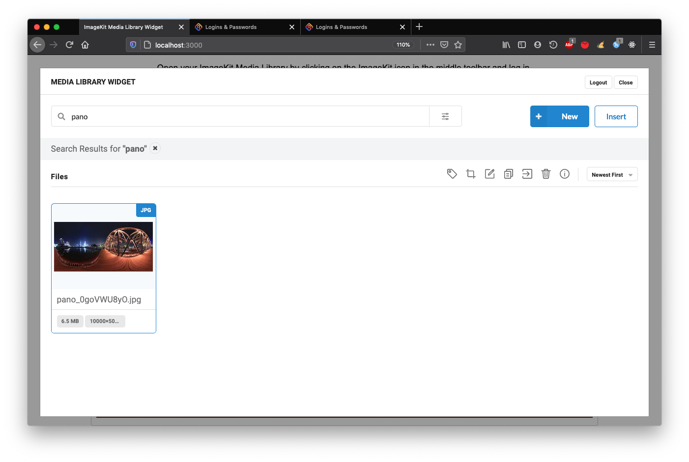
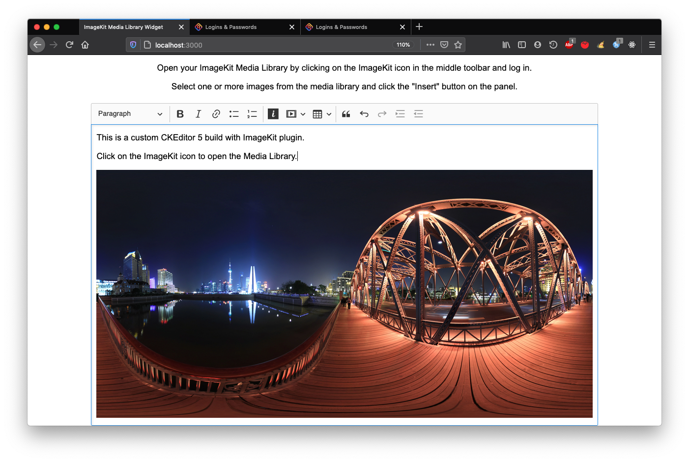

# CKEditor integration

ImageKit can be integrated into CKEditor 5 using the [`imagekit-ckeditor5-plugin`](https://www.npmjs.com/package/imagekit-ckeditor5-plugin) available on npm. This plugin allows you to access the [Media Library Widget](https://github.com/imagekit-developer/embeddable-media-library) through your CKEditor toolbar.

Using it, you can directly embed images from your ImageKit Media Library into the editor and upload new photos to your Media Library.


## Installation

To install this plugin, you should make a custom build of CKEditor 5. Use the quickstart guide further below, or follow the instructions [here](https://ckeditor.com/docs/ckeditor5/latest/builds/guides/development/custom-builds.html). 

You can also integrate the plugin into an existing CKEditor build.

### For existing CKEditor build

Install the `imagekit-ckeditor5-plugin` into your existing CKEditor 5 build:

```text
npm install --save-dev imagekit-ckeditor5-plugin
```

### Version support

Check the [version support list](https://github.com/imagekit-developer/ckeditor-plugin) to find out which versions of CKEditor core packages will work with this plugin. Mostly, versions upwards of v24.0.0 are supported.


Please ensure that all CKEditor-related packages you install belong to a single one of the supported versions. Otherwise, the build will throw ["ckeditor-duplicated-modules" error](https://ckeditor.com/docs/ckeditor5/latest/framework/guides/support/error-codes.html#error-ckeditor-duplicated-modules) in the browser and fail to work.


## Quickstart

Clone the CKEditor 5 repository at the latest supported version:

```text
git clone --depth 1 --branch v24.0.0 https://github.com/ckeditor/ckeditor5.git
```

Navigate to the build that will be customized and install dependencies. We will use the classic build:

```bash
cd ckeditor5/packages/ckeditor5-build-classic
npm install
```

Install the ImageKit CKEditor plugin in your custom build folder:

```bash
npm install --save-dev imagekit-ckeditor5-plugin
```

## Configuration and build

To load the plugin, configure your editor by editing the `src/ckeditor.js` file that belongs to the chosen build. Import the Media Library Widget within it as follows:

```javascript
/* ckeditor5-build-classic/src/ckeditor.js */

// ...imported modules
// custom plugin import
import { ImagekitMediaLibraryWidget } from 'imagekit-ckeditor5-plugin';

export default class ClassicEditor extends ClassicEditorBase {}

// Plugins to include in the build.
ClassicEditor.builtinPlugins = [
  // include custom plugin in build
  ImagekitMediaLibraryWidget,
  // ...other components
];

// COnfigure the `imagekitMediaLibraryWidget` plugin to display on the editor toolbar
ClassicEditor.defaultConfig = {
  toolbar: {
    items: [
      'imagekitMediaLibraryWidget',
      // ...other ckeditor plugins
    ]
  },
  // ...other settings
  language: 'en'
};
```

### Build

Build the editor as follows:

```bash
npm run build
```

Copy the built files into the source of your webpage, which will host the editor:

```bash
cp -r build/ <path_to_your_web_project>
```

## Frontend installation

Import the generated build files in your web project:

```markup
<script src="<path_to_web_project>/ckeditor.js"></script>
```

Provide HTML container elements for widget instance as well as editor instance:

```markup
<div class="editor"></div>
<div class="ml-container"></div>
```

Create a JavaScript object with configuration options for the plugin:

```javascript
var pluginOptions = {
  container: '.ml-container',
  className: 'media-library-widget',
  dimensions: {
    height: '100%',
    width: '100%',
  },
};
```

Create an editor instance that includes the `imagekitMediaLibraryWidget` plugin on the toolbar, with its configuration options.

```javascript
// ckeditor
var editor;

// initialize ckeditor
ClassicEditor
  .create(document.querySelector('.editor'), {
      imagekitMediaLibraryWidget: {
        config: pluginOptions
      }
    })
  .then(newEditor => {
    editor = newEditor;
    window.editor = newEditor;
  }).catch(error => {
    console.error(error);
  });
```

### Usage <a id="usage"></a>

Open a browser and navigate to your app with the CKEditor instance. It should look similar to the image below. To open ImageKit view, click on the highlighted icon:


If you are not logged in already, do so using your ImageKit username and password.



The Media Library view should open right up, let you search and select existing images, and upload new ones directly.



To insert one or more images into the CKEditor panel, select them and click the "Insert" button in the top right-hand area. The modal dialog will close, and selected images will be inserted into the editor.



### **Note: On using Google Chrome in Incognito mode**

To use this plugin on Google Chrome in Incognito mode, you need to enable third-party cookies:


